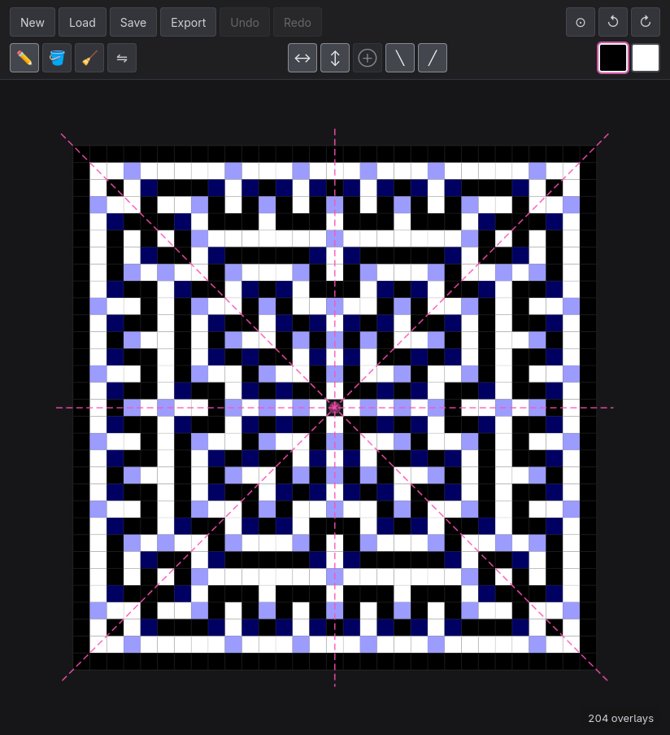
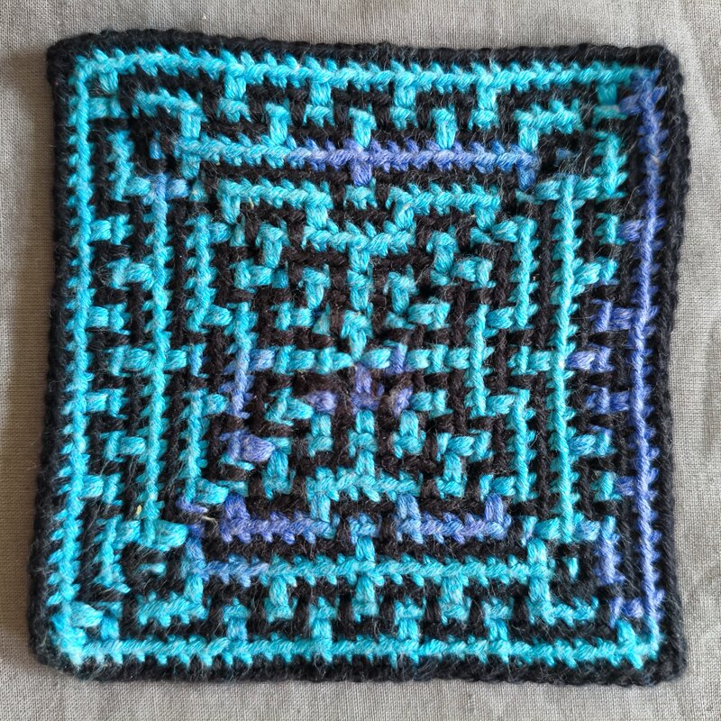

# Mosaic Crochet Web

A browser-based design tool for inset mosaic crochet patterns. Draw pixel patterns, get real-time stitch validation, and export human-readable crochet instructions.

**▶ [Try it now](https://lechaosx.github.io/mosaic-crochet-editor/)** — no install, runs in your browser.

Companion to the [Aseprite plugin](https://github.com/lechaosx/aseprite-mosaic-crochet) for the same workflow inside Aseprite.

---

<table>
<tr>
<td></td>
<td></td>
</tr>
</table>

```
Round 1: ([sc, ch] × 4)
Round 2: [(sc, ch, sc), oc] × 4
Round 3: [(sc, ch, sc), oc, sc, oc] × 4
Round 4: [(sc, ch, sc), oc, [sc, oc] × 2] × 4
Round 5: [(sc, ch, sc), oc, [sc, oc] × 3] × 4
Round 6: [(sc, ch, sc), oc, [sc × 3, oc] × 2] × 4
Round 7: [(sc, ch, sc), [oc, sc] × 2, sc × 3, [sc, oc] × 2] × 4
Round 8: [(sc, ch, sc), oc, [sc × 3, oc] × 3] × 4
Round 9: [(sc, ch, sc), oc, sc × 4, [sc, oc] × 2, sc × 5, oc] × 4
Round 10: [(sc, ch, sc), oc, [sc × 7, oc] × 2] × 4
Round 11: [(sc, ch, sc), oc, sc × 17, oc] × 4
Round 12: [(sc, ch, sc), sc, [sc, oc, sc × 2] × 5] × 4
Round 13: [(sc, ch, sc), oc, sc × 2, [sc, oc] × 8, sc × 3, oc] × 4
Round 14: [(sc, ch, sc), oc, sc × 2, [sc × 3, oc] × 4, sc × 5, oc] × 4
Round 15: [(sc, ch, sc), sc × 27] × 4
```

---

For decisions and rationale, see [FEATURES.md](FEATURES.md) (product) and [ARCHITECTURE.md](ARCHITECTURE.md) (technical).

---

## Using the app

### Patterns

Click **Pattern** to open the dimensions popover. Two modes:

- **Row** — a rectangular grid worked row by row. Set width and height.
- **Round** — concentric rounds worked from the outside in. Set inner width / height / rounds, plus a sub-mode:
  - **Full** — all four sides.
  - **Half** — bottom half only; the pattern folds at the inner-hole boundary.
  - **Quarter** — bottom-left quarter; folds at both inner-hole boundaries.

Settings update the canvas live and the **Wipe** toggle controls whether existing pixels are preserved across the change. Light-dismissing the popover commits your changes; **Ctrl+Z** reverts.

### Drawing

Eight tools, in the toolbar's tools group:

- **Pencil** — paint the active colour.
- **Fill** — flood-fill a connected region (stops at the selection boundary when a selection is active).
- **Eraser** — left click restores pixels to the underlying alternating colour; right click paints the *opposite* (the exact inverse).
- **Overlay** — click where you want a ✕; the inward neighbour is painted so the highlight pass draws a ✕ at the clicked cell. Right-click clears it. No-op on round-mode corners (no overlay stitch fits there).
- **Invert** — flip pixels between primary and secondary on draw. Within one stroke, no pixel is inverted twice.
- **Select** — drag a rectangle to **lift** those cells into a floating selection: their values move into the float, the canvas below them resets to the natural alternating colour. **Shift+drag** adds to the selection; **Ctrl+drag** removes (re-anchors the rest); no-modifier replaces. A single click lifts one cell.
- **Magic wand** — click a cell to lift its connected same-colour region as a float. Same Shift / Ctrl / no-modifier semantics as the rect tool.
- **Move** — drag inside the float to reposition it. Release just stops dragging; the float stays alive until you deselect (`Ctrl+Shift+A`), switch out via the Edit popover, save, or do something else that anchors it. **Ctrl+drag** stamps the float into the canvas at its current position the moment you press, so you visibly drag a duplicate. **Shift+drag** moves the marquee only — the float's pixels are cleared at the start, the drag carries an empty selection, and on release the canvas content at the new position is re-lifted as the new float. **Hold Alt** with any tool to temporarily swap into Move; releasing Alt restores the previous tool.

All five drawing tools respect the active symmetries. The eraser restores each mirrored pixel to *its own* natural colour, not the click point's.

When a selection is active, painting tools clip to its visible marquee: changes inside the float go to the float's pixels; clicks outside the marquee do nothing. The boundary appears as marching ants in a palette-aware accent colour. Holes (transparent cells) behave as outside the selection — never lifted, never affected by paint through the float.

`Ctrl+C` copies the float to the clipboard *and* stamps it into the canvas at its current position (the marquee stays alive). `Ctrl+X` cuts: clipboard gets the content, canvas under the float clears to baseline, and the selection drops. `Ctrl+V` pastes from the clipboard back at the original copy location as a non-destructive float — moving it leaves the canvas underneath alone, so paste-then-move is duplicate by default.

**Mouse:** left click paints with the primary colour, right click paints with the secondary.
**Touch / pen:** single-finger drag paints with the primary colour. Selecting the secondary swatch (tap it, or press **2**) paints with the secondary instead.

A ✕ marks valid overlay-stitch positions; a ! marks invalid placements. Both are drawn in the *opposite* pixel colour so they stay visible against either palette, and they update as you draw.

### Symmetry

Five axes — **↔ Vertical**, **↕ Horizontal**, **⊕ Central**, **╲ Diagonal**, **╱ Anti-diagonal** — toggled from the symmetry group. Active axes are drawn as dashed lines on the canvas.

Two axes that imply a third turn the third on automatically (closure inference). Directly toggled axes display brightly; closure-implied ones are dimmed. Diagonals are unavailable when `(W − H)` is odd.

### Colours

Two swatches: primary (left) and secondary (right). Click to select; double-click or long-press to edit the colour. The active swatch has a glowing outline.

### Highlights

The **⚙** button on the right of the toolbar opens a Settings popover:

- **Highlight opacity** — fades the ✕ / ! glyphs; 0 hides them entirely. Defaults to 100%.
- **Show numbers** — row numbers in the left gutter, round numbers above (half/quarter) or in the corner cells (full).
- **Lock cells with no valid overlay** — blocks paint on cells where an overlay stitch can't physically fit (top row in row mode; outermost ring and diagonal corners in round mode). Fixing an already-wrong cell still works.

### Zoom, pan, rotation

- **Zoom**: scroll wheel (anchored at the cursor) or two-finger pinch on touch (anchored at the gesture midpoint). Auto-fits to the viewport on every new pattern, file load, or refresh — including when the pattern is rotated.
- **Pan**: middle-mouse drag, or two-finger drag on touch.
- **Rotate**: ↺ / ↻ buttons. Rotates ±45° around the pattern centre with a 250 ms animation. A small accent triangle near the top edge of the pattern fades in during the animation so you can tell which way is "up".

### Saving

- **Save** downloads the pattern as a `.mcw` file (JSON). Modern browsers (Chrome/Edge) open a save dialog; Firefox downloads immediately.
- **Load** opens a file picker and restores the entire pattern, including colours and symmetry.
- **Export** opens a modal where the pattern is converted to text line-by-line. Toggle **Alternate direction** to flip the work direction. Copy or download the result.

Tool, colour, symmetry, rotation, the active float (selection + lifted pixels), and the committed canvas auto-save to `localStorage` and restore on refresh. The float isn't written to `.mcw` files (it's transient editing state, not pattern data) — Save and Export bake the float into the file/export and leave the live selection alone.

### Keyboard shortcuts

| Action | Key |
|---|---|
| Pencil / Fill / Eraser / Overlay / Invert / Select / Wand / Move | **P** / **F** / **E** / **O** / **I** / **S** / **W** / **M** |
| Hold Alt — temporary Move tool (any active tool) | **Alt** |
| Vertical / Horizontal / Central symmetry | **V** / **H** / **C** |
| Diagonal ╲ / Anti-diagonal ╱ | **D** / **A** |
| Rotate clockwise / counter-clockwise | **R** / **Shift+R** |
| Select primary / secondary swatch | **1** / **2** |
| Select all paintable cells / Deselect | **Ctrl+A** / **Ctrl+Shift+A** |
| Copy selection / Cut to clipboard / Paste as a free float | **Ctrl+C** / **Ctrl+X** / **Ctrl+V** |
| Undo / Redo | **Ctrl+Z** / **Ctrl+Y** (or **Ctrl+Shift+Z**) |

Every button has a hover label that shows the same info.

---

## Running locally

### Prerequisites

- [Nix](https://nixos.org/) with flakes enabled

### First-time setup

```sh
# Enter the dev shell (installs rustup, wasm-pack, bun, cargo-watch)
nix develop

# Install the nightly Rust toolchain
rustup toolchain install nightly

# Install JS dependencies
bun install
```

### Development

```sh
bun run dev
```

Starts the Rust watcher and the Vite dev server in parallel. Open [http://localhost:5173](http://localhost:5173).

- TypeScript changes reload instantly via Vite HMR.
- Rust changes trigger a WASM rebuild (a few seconds), after which Vite reloads the page.

### Tests

```sh
bun run test
```

Chains all three layers:

- **Rust** (`cargo test`) — geometry, walk generators, pattern compression.
- **TS unit + properties** (`bun run --cwd web test`, Vitest) — store / selection / paint / clipboard / symmetry / storage / history / pattern + `fast-check`-generated property assertions for pack/unpack round-trips, lift-anchor identity, wand BFS invariants, history undo/redo balance.
- **E2E** (`bun run --cwd web test:e2e`, Playwright) — full UX flows: tool switching, paint pixel verification via `getImageData`, selection / move / copy / cut / paste, symmetry mirroring, Edit popover.

Run a subset:

```sh
bun run --cwd web test                # Vitest only
bun run --cwd web test:watch          # Vitest interactive
bun run --cwd web test:coverage       # Istanbul HTML report at web/coverage/index.html
bun run --cwd web test:e2e            # Playwright only
```

> On NixOS, the dev shell provides `playwright-driver.browsers` and sets `PLAYWRIGHT_BROWSERS_PATH` for you. The `@playwright/test` npm version is pinned to match nixpkgs's bundled chromium.

### Production build

```sh
bun run build
```

Output is in `web/dist/`.

### Deployment

Pushes to `master` automatically deploy to GitHub Pages via GitHub Actions. Enable Pages in the repo settings with **GitHub Actions** as the source.
