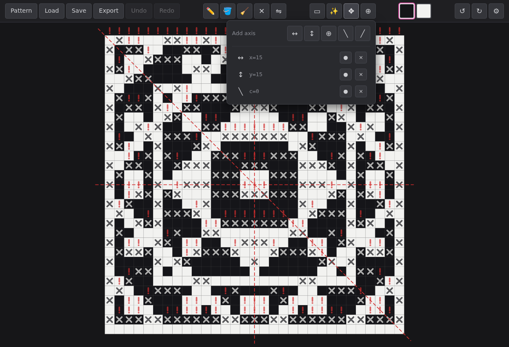
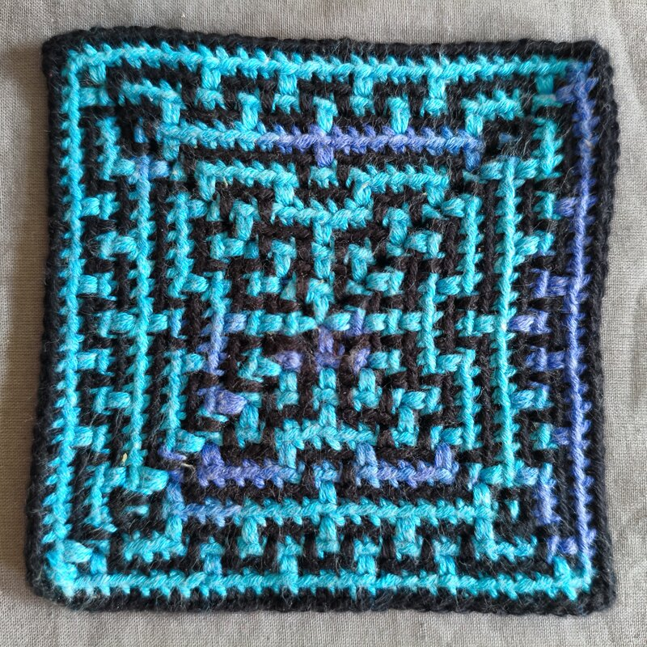

# Mosaic Crochet Web

A browser-based editor for alternating-yarn mosaic crochet charts. Draw pixel patterns, review derived overlay positions, and export a chart-derived work sequence.

**▶ [Try it now](https://lechaosx.github.io/mosaic-crochet-editor/)** — no install, runs in your browser.

Companion to the [Aseprite plugin](https://github.com/lechaosx/aseprite-mosaic-crochet) for the same workflow inside Aseprite.

---

<table>
<tr>
<td></td>
<td></td>
</tr>
</table>

```
Round 1: ([sc, ch] × 4)
Round 2: [(sc, ch, sc), oc] × 4
Round 3: [(sc, ch, sc), oc, sc, oc] × 4
Round 4: [(sc, ch, sc), oc, [sc, oc] × 2] × 4
Round 5: [(sc, ch, sc), oc, [sc, oc] × 3] × 4
Round 6: [(sc, ch, sc), oc, [sc × 3, oc] × 2] × 4
Round 7: [(sc, ch, sc), [oc, sc] × 2, sc × 3, [sc, oc] × 2] × 4
Round 8: [(sc, ch, sc), oc, [sc × 3, oc] × 3] × 4
Round 9: [(sc, ch, sc), oc, sc × 4, [sc, oc] × 2, sc × 5, oc] × 4
Round 10: [(sc, ch, sc), oc, [sc × 7, oc] × 2] × 4
Round 11: [(sc, ch, sc), oc, sc × 17, oc] × 4
Round 12: [(sc, ch, sc), sc, [sc, oc, sc × 2] × 5] × 4
Round 13: [(sc, ch, sc), oc, sc × 2, [sc, oc] × 8, sc × 3, oc] × 4
Round 14: [(sc, ch, sc), oc, sc × 2, [sc × 3, oc] × 4, sc × 5, oc] × 4
Round 15: [(sc, ch, sc), sc × 27] × 4
```

---

For decisions and rationale, see [FEATURES.md](FEATURES.md) (product) and [ARCHITECTURE.md](ARCHITECTURE.md) (technical).

---

## Using the app

The workspace separates document commands from authoring controls. On wide screens, tools occupy a left rail and an opened inspector takes a right column beside the canvas. On narrower screens, the same tool groups move below the canvas and the same inspector becomes a non-modal bottom sheet. Pattern, Selection, Mirror & Repeat, and Settings share that inspector; its close button dismisses the current section. At phone widths, lower-frequency document commands and Settings move into **More**.

### Patterns

Click **Pattern** to open the dimensions inspector. Two modes:

- **Rows** — a rectangular grid worked row by row. Height includes the unnumbered bottom foundation; the row above it is Row 1.
- **Centre-out** — concentric rounds numbered from the innermost band outward. Set inner width / height / rounds, plus an authored extent:
  - **Full** — all four sides.
  - **Half** — bottom half only.
  - **Quarter** — bottom-left quarter only.

Settings update the canvas live and the **Wipe** toggle controls whether existing pixels are preserved across the change. Choose **Apply** to commit the preview as one Undo step, or **Cancel** / **Escape** to restore the state from when Pattern opened. Invalid input keeps the last valid preview and disables Apply. Clicking elsewhere does not dismiss Pattern or edit the canvas; canvas zoom remains available while you decide.

Canvas dimensions may contain up to 16,777,216 cells total, with either axis up to 1,048,576 cells for unusually long, narrow patterns. The Pattern inspector reports an inline error without replacing the current canvas when those safety bounds are exceeded; invalid `.mcw` dimensions are rejected during load.

### Drawing

Eight tools, grouped in the authoring dock:

- **Pencil** — paint the active colour.
- **Fill** — flood-fill a connected region (stops at the selection boundary when a selection is active).
- **Eraser** — left click restores pixels to the underlying alternating colour; right click paints the *opposite* (the exact inverse).
- **Overlay** — click where you want a ✕; the inward neighbour is painted so the highlight pass draws a ✕ at the clicked cell. Right-click clears it. A diagonal round-corner pixel is not overlayable because it emits the complete `(sc, ch, sc)` group; neighbouring pixels retain normal Overlay behavior.
- **Invert** — flip pixels between primary and secondary on draw. Within one stroke, no pixel is inverted twice.
- **Select** — drag a rectangle to **lift** those cells into a floating selection: their values move into the float, the canvas below them resets to the natural alternating colour. **Shift+drag** adds to the selection; **Ctrl+drag** removes (re-anchors the rest); no-modifier replaces. A single click lifts one cell.
- **Magic wand** — click a cell to lift its connected same-colour region as a float. Same Shift / Ctrl / no-modifier semantics as the rect tool. Dragging can sweep across regions; the entire sweep is one Undo step.
- **Move** — drag inside the float to reposition it. Release just stops dragging; the float stays alive across tool changes and saving until you deselect (`Ctrl+Shift+A`), replace the selection, resize the pattern, or load another file. **Ctrl+drag** stamps the float into the canvas at its current position the moment you press, so you visibly drag a duplicate. **Alt+drag** is mask-only: the float's content is baked into the canvas at the start, the drag carries the same marquee shape, and on release the canvas content at the new position is re-lifted as the new float (the original content stays where it was). The Selection card exposes **Move content**, **Duplicate content**, and **Move selection area** as modifier-free outcomes; choosing one activates Move and closes the card so the canvas is ready for the drag. Leaving Move resets the outcome to Move content. The **Mask** toggle beside Move is a compact shortcut for Move selection area. **Shift+drag** has no special meaning on the Move tool — it behaves as a regular move.

With **Apply while drawing** enabled, all five drawing tools respect the configured symmetry and repeat transforms. Turn it off to edit only the source cell while keeping the same transformation ready for selection stamping. The eraser restores each transformed pixel to *its own* natural colour, not the click point's.

When a selection is active, painting tools clip to its visible marquee: changes inside the float go to the float's pixels; clicks outside the marquee do nothing. The boundary appears as marching ants in a palette-aware accent colour. Holes (transparent cells) behave as outside the selection — never lifted, never affected by paint through the float.

Tap or click the selected-cell count in the context strip to open the Selection card. It provides labelled Copy, Cut, Paste, and Deselect actions alongside their keyboard hints. Deselect places the floating content into the pattern before removing the selection. After Cut or Deselect, the same trigger shows the number of copied cells while the in-memory clipboard remains available.

`Ctrl+C` copies the float to the clipboard (non-destructive — canvas and marquee stay unchanged). `Ctrl+X` cuts: clipboard gets the content and the selection drops; canvas cells are cleared to baseline only when every cell's value matches the float (all-or-nothing — if anything differs, the canvas is left alone). `Ctrl+V` pastes from the clipboard back at the original copy location as a non-destructive float — moving it leaves the canvas underneath alone, so paste-then-move is duplicate by default.

**Mouse:** left click paints with the active yarn; right click temporarily paints with the other yarn.
**Touch / pen:** single-finger drag paints with the active yarn. Select Yarn A or B by tapping its labelled swatch or pressing **1** or **2**. Tap the selected-cell count for selection and clipboard actions or a modifier-free move outcome.

A ✕ marks valid overlay-stitch positions; a ! marks invalid placements. Both are drawn in the *opposite* pixel colour so they stay visible against either palette, and they update as you draw.

### Symmetry and repeat

New patterns start without active transforms. Open **Symmetry and repeat** and add any of five axis kinds: **↔ Vertical**, **↕ Horizontal**, **⊕ Central**, **╲ Diagonal**, or **╱ Anti-diagonal**. Each axis has its own enable/disable and delete controls, whose hover and accessibility labels identify the axis kind and position. You can add multiple axes of the same kind.

Active mirror axes are drawn as dashed guides; central rotation is shown as a dot. With the **Move** tool, drag a guide to reposition it. Vertical, horizontal, and central axes snap to half-cells; diagonals snap to whole cells. Dragging an axis beyond its useful canvas range deletes it. Diagonal axes work on rectangular canvases of any parity.

Active axes compose automatically: for example, vertical and horizontal mirrors together produce the corresponding four-cell orbit without adding a separate central-axis entry.

Enable **Include repeat** to add fixed tile offsets to the transformation. Horizontal and vertical copy counts are per side: `1` horizontal and `1` vertical produces a 3×3 set of positions including the source. When symmetry and repeat are both configured, symmetry creates the complete motif first and the repeat grid tiles that motif. Dotted tile guides remain visible while repeat is included and preview while the inspector is open.

With a floating selection and the inspector open, ghost cells preview exactly where the current mirror-and-repeat recipe will stamp the selected cells. Sparse selections remain sparse. The horizontal and vertical distance lines end in draggable circular handles whenever that direction has copies; drag a handle to adjust the corresponding tile dimension, or enter the exact whole-cell value in the inspector. Each drag is one undoable edit.

The repeat grid accepts at most 4,096 positions. Operations also abort instead of leaving partial output if their transformed target claims exceed 1,048,576.

**Apply while drawing** affects future pencil, fill, eraser, overlay, and invert operations only. **Stamp transformed copies** applies the same configured transformation to content that already exists in the floating selection, even when live drawing is off. Choose it or press **T**; the source selection stays active and the entire stamp is one undo step. Off-canvas sources and inner-hole destinations are skipped. If differently coloured source cells claim the same destination, the action reports the conflict in the transform inspector and leaves the canvas unchanged.

The transform dock button has no badge when no recipe is configured, an accent dot while configured transforms apply during drawing, and a pause badge when the recipe remains configured but live application is off.

### Yarns

The labelled **Yarn A** and **Yarn B** swatches remain directly available at every dock size. A visible check and outline identify the active yarn independently of colour. Click, tap, Enter, or Space selects a yarn. **Edit** opens the native colour picker for the active yarn; double-clicking or long-pressing either swatch edits that yarn directly. **Swap** exchanges the two colours without changing the pattern's A/B cells or which logical yarn is active, and Undo restores the previous colours.

### Highlights

The **⚙** button in the document bar opens Settings in the inspector:

- **Highlight opacity** — fades the ✕ / ! glyphs; 0 hides them entirely. Defaults to 100%.
- **Show numbers** — worked-row numbers in the left gutter with the foundation left unnumbered; round numbers appear above half/quarter charts or in the corner cells of full charts.
- **Lock cells with no valid overlay** — blocks paint on cells where an overlay stitch can't physically fit (top row in Rows; outermost ring and diagonal corners in Centre-out). Fixing an already-wrong cell still works.

### Zoom, pan, rotation

- **Zoom**: use **−** / **+** in the canvas controls, scroll the wheel, or pinch with two fingers. Buttons preserve the canvas-centre focal cell; wheel and pinch use the pointer or gesture midpoint. The displayed value is the rendered cell size. New patterns, loaded files, and refreshes auto-fit to the viewport.
- **Fit**: centres the whole pattern and fits its current rotated bounds into the canvas.
- **Pan**: choose **Navigate** and drag with mouse, pen, or one finger; choose an authoring tool to leave Navigate. Hold **Space** while dragging for momentary Navigate. Middle-mouse drag and two-finger drag remain direct shortcuts.
- If the browser or operating system cancels an active drawing pointer, the unfinished edit is discarded. Starting a two-finger gesture also discards any unfinished one-finger edit before navigation begins.
- **Rotate view**: ↺ / ↻ rotate ±45° around the pattern centre; **0°** resets the view rotation. A small accent triangle near the top edge of the pattern fades in during the animation so you can tell which way is "up".

### Saving

- **Save .mcw** saves the editable pattern as a `.mcw` file (JSON). Modern browsers (Chrome/Edge) open a save dialog; Firefox downloads immediately.
- **Load** opens a file picker and restores pattern geometry, pixels, and colours. Symmetry and repeat transforms are session state and remain unchanged. Invalid files and files from a newer unsupported `.mcw` version are reported without replacing the current pattern.
- **Instructions** opens a peer workspace on **Overview**. The finished chart and crochet-order row/round list share focus: selecting a work unit highlights its complete path without editing the pattern or recording progress. Landscape layouts place chart and list side by side; portrait layouts stack them. **Live** uses that same chart to show the current row/round path, yarn, and compressed work. **Done** advances one complete row/round and **Back** reverses one; the confirmed boundary resumes locally only when the complete regenerated instruction plan matches. Live progress is not saved in `.mcw` or project Undo, and Live remains unavailable while unresolved overlay positions make the plan unsafe. If browser storage rejects a progress update, Live warns you to keep the tab open. **Text** shows the exact compressed output used by Copy and Download, with a legend for `sc`, `ch`, and the chart-required `oc` operation. Each `oc` belongs to the worked row or round containing its visible ✕, while the covered supporting pixel remains an internal chart detail. Toggle **Alternate direction** to regenerate all three views with the other work direction. **Back to Design** restores the editor without changing its canvas, selection, tools, or view.
- Invalid overlay placements remain inspectable in Overview as spatially linked blockers. Text stays available as an explicit draft: `?` marks unresolved work inside a generated row/round, and a coordinate-bearing unresolved line identifies every blocker, including work that falls outside the generated chart path.

Tool, colour, symmetry axes, repeat grid, live-transform mode, rotation, settings, the active float, and the committed canvas auto-save to browser-local recovery and restore on refresh. The document bar reports **Saved locally**, **Recovered from this device**, or **Local save failed**; a failure means recent changes may be lost if the tab closes. This automatic recovery is separate from **Save .mcw** and never means an editable pattern file was updated. Drawing remains live on the canvas while dragging and updates recovery storage when the stroke is released. Existing v4 browser recovery and Undo history migrate automatically to the current version. `.mcw` files contain pattern geometry, pixels, and colours only. Save and Instructions bake the visible float into their output without changing the live selection.

The context strip at the bottom of the canvas shows the active tool and Yarn A/B, overlay totals, invalid placements, selection size, and whether configured transforms are live or paused. Pattern coordinates appear while the pointer is over the canvas. The selection or clipboard count opens its contextual action card. The strip wraps on compact screens.

When a canvas action cannot proceed, the context strip explains the immediate cause: the pointer is outside the selection, Move needs a selection or must start inside it, an Overlay target has no inward supporting cell, or Settings skipped a protected destination. Repeated blocked cells in one drag produce one message; beginning another canvas action clears it.

### Responsive workspace

Authoring is tool-led rather than controlled by a global strategy switch. **Colour** contains Pencil, Fill, Eraser, and Invert; **Overlay** places the chart-required overlay operation; **Arrange** contains Select, Magic wand, Move, and Mirror & Repeat. The canvas context identifies the active group and tool. Wide tool rails show group headings, while compact layouts omit the headings and retain the same ordered controls and active-context text.

Controls use a minimum 36 × 36 CSS-pixel target on wide fine-pointer layouts and 44 × 44 CSS pixels when touch input is available or space is compact. At 64rem and wider the authoring dock is a left rail and an open inspector is pinned beside the canvas. Below that width the dock wraps beneath the canvas and the inspector overlays it as a bottom sheet. The current phone dock keeps all eight authoring tools and both yarns visible across up to three rows; Pattern, Load, Save, Instructions, and Settings move into **More**. Responsive recomposition moves the same controls without changing their state or behavior.

### Keyboard shortcuts

Toolbar tools and yarn swatches expose their selected state to assistive technology. Yarn swatches respond to Enter and Space. Pattern choices and switches remain native radio buttons and checkboxes, so they can be focused and operated with the standard arrow and Space keys.

| Action | Key |
|---|---|
| Pencil / Fill / Eraser / Overlay / Invert / Select / Wand / Move | **P** / **F** / **E** / **O** / **I** / **S** / **W** / **M** |
| Add Vertical / Horizontal / Central axis | **V** / **H** / **C** |
| Add Diagonal ╲ / Anti-diagonal ╱ axis | **D** / **A** |
| Stamp transformed copies from the selection | **T** |
| Rotate clockwise / counter-clockwise | **R** / **Shift+R** |
| Select Yarn A / Yarn B | **1** / **2** |
| Select all paintable cells / Deselect / Clear selection | **Ctrl+A** / **Ctrl+Shift+A** / **Esc** |
| Delete selection content (keeps selection active) | **Delete** |
| Nudge float / Nudge ×5 | **Arrow** / **Shift+Arrow** |
| Bake position into canvas, nudge float | **Ctrl+Arrow** / **Ctrl+Shift+Arrow** |
| Mask-only nudge (stamp + move marquee, re-lifts on release) | **Alt+Arrow** / **Alt+Shift+Arrow** |
| Copy selection / Cut to clipboard / Paste as a free float | **Ctrl+C** / **Ctrl+X** / **Ctrl+V** |
| Undo / Redo | **Ctrl+Z** / **Ctrl+Y** (or **Ctrl+Shift+Z**) |

Every button has a hover label that shows the same info.

---

## Running locally

### Prerequisites

- [Nix](https://nixos.org/) with flakes enabled

### First-time setup

```sh
# Enter the dev shell (installs rustup, wasm-pack, bun, cargo-watch)
nix develop

# Install the nightly Rust toolchain
rustup toolchain install nightly

# Install JS dependencies
bun install
```

### Development

```sh
bun run dev
```

Starts the Rust watcher and the Vite dev server in parallel. Open [http://localhost:5173](http://localhost:5173).

- TypeScript changes reload instantly via Vite HMR.
- Rust changes trigger a WASM rebuild (a few seconds), after which Vite reloads the page.

### Tests

```sh
bun run test
```

Builds the generated WASM package and production web bundle, then runs all three test layers:

- **Rust** (`cargo test`) — geometry, walk generators, pattern compression.
- **TS unit + properties** (`bun run test:logic` for pure logic, `bun run test:web` for IO layer, Vitest) — store / selection / paint / clipboard / symmetry / repeat / storage / pattern + `fast-check`-generated property assertions for pack/unpack round-trips, lift-anchor identity, wand BFS invariants, history undo/redo balance; plus history and localStorage persistence.
- **E2E** (`bun run test:e2e`, Playwright, desktop Chromium) — full UX flows: adaptive workspace, tool switching, paint pixel verification via `getImageData`, selection / move / copy / cut / paste, symmetry and repeat transforms, Pattern inspector.

CI rejects Rust formatting drift and reports Clippy warnings with `cargo fmt --all -- --check` and `cargo clippy --workspace`.

Run a subset:

```sh
bun run test:logic                    # Vitest — pure logic (logic/tests/)
bun run test:web                      # Vitest — IO layer (web/tests/)
bun run --cwd web test:watch          # Vitest interactive
bun run --cwd web test:coverage       # Istanbul HTML report at web/coverage/index.html
bun run test:mutation                 # Stryker mutation sweep on logic (report at logic/reports/mutation/mutation.html)
bun run test:e2e                      # Production build + Playwright
```

> On NixOS, the dev shell provides `playwright-driver.browsers` and sets `PLAYWRIGHT_BROWSERS_PATH` for you. The `@playwright/test` npm version is pinned to match nixpkgs's bundled chromium.

### Production build

```sh
bun run build
```

Output is in `web/dist/`.

### Deployment

Pushes to `master` automatically deploy to GitHub Pages via GitHub Actions. Enable Pages in the repo settings with **GitHub Actions** as the source.
