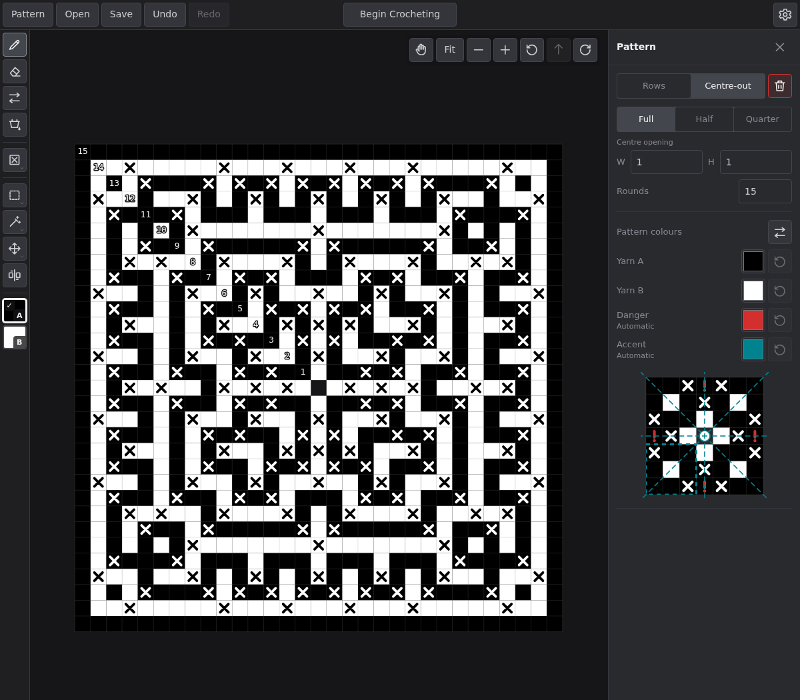
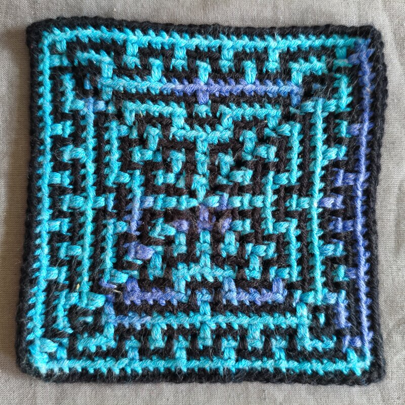

# Mosaic Crochet Editor

A browser-based editor for designing alternating-yarn mosaic crochet charts and turning them into chart-derived row-by-row or round-by-round instructions.

**[Open the editor](https://lechaosx.github.io/mosaic-crochet-editor/)** — no installation or account required.

<table>
<tr>
<td></td>
<td></td>
</tr>
</table>

## Capabilities

- Rectangular row patterns and full, half, or quarter centre-out patterns
- Two-yarn drawing with customizable colours, overlay-stitch guidance, and impossible-placement warnings
- Selection, movement, copying, repetition, rotation, and mirroring of motifs
- Multiple global symmetry axes that apply while drawing
- Generated crochet instructions that can be copied, with progress shown on the chart
- Editable `.mcw` project files, with separate browser-local recovery for in-progress work
- Accessible desktop and mobile layouts with mouse, touch, pen, and keyboard support

The controls are designed to be discovered in the app, with labels and tooltips available where they are needed.

The generated sequence covers the work encoded by the chart; foundation, joining, and finishing methods remain the crocheter's choice.

Mosaic Crochet Editor is also available as an [Aseprite plugin](https://github.com/lechaosx/aseprite-mosaic-crochet).

## Project documentation

- [Release notes](RELEASE_NOTES.md) summarize changes visible to users.
- [Product model](FEATURES.md) records the durable user-facing decisions behind the editor.
- [Architecture](ARCHITECTURE.md) records the technical boundaries contributors must preserve.
- [Chart dialect](doc/chart-dialect.md) defines how chart cells become crochet instructions.
- [Crochet validation protocol](doc/instructions-validation.md) describes how generated instructions are evaluated with crocheters.

## Developing locally

The development environment requires [Nix](https://nixos.org/) with flakes enabled.

```sh
nix develop
npm ci
npm run dev
```

The development server runs at [http://localhost:5173](http://localhost:5173). Vite reloads TypeScript changes immediately; Rust changes rebuild the WebAssembly package first.

Run the complete test suite before submitting changes:

```sh
npm run test
```

Useful narrower commands are `npm run test:tooling`, `npm run test:rust`, `npm run test:logic`, `npm run test:web`, and `npm run test:e2e`. Run `npm run build` for a production build in `web/dist/`.

Pushes to `master` deploy to GitHub Pages through GitHub Actions.
